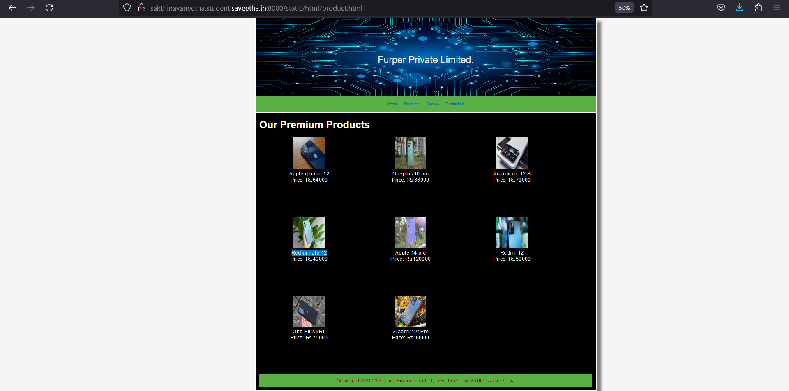

# Web Design for a Software Product Company

## AIM:

To design a static website for a software product company company.

## DESIGN STEPS:

### Step 1:

Requirement collection.

### Step 2:

Creating the layout using HTML and CSS.

### Step 3:

Updating the sample content.

### Step 4:

Choose the appropriate style and color scheme.

### Step 5:

Validate the layout in various browsers.

### Step 6:

Validate the HTML code.

### Step 6:

Publish the website in the given URL.

## PROGRAM :
home.html
<!DOCTYPE html>
<html lang="en">
  <head>
    <title>Furper Private Limited</title>
    
    
    <link rel="stylesheet" href="/static/css/layout.css">
    <link rel="icon" href="/static/img/icon.png" type="image/x-icon">
  </head>

  <body>
    

      
Furper Private Limited.>

      
      

        
<a href="/home/">Home</a>

        
<a href="/products/">Products</a>

        
<a href="/people/">People</a>

        
<a href="/contactus/">Contact Us</a>

      

      

        

          <h1>About Us</h1>
          
          

            Furper is London's 1st Online Shopping Store For Only Global Products At Lowest Price . 
            Our goal is to deliver quality products in London and worldwide.  
            Our every product is full-filled by furper. 
            We ship our innovative products in every small city in London and elsewhere.  
            With an intuitive interface and customizable features, you can easily discover the  
            full potential of the product without needing to learn any new skills. 
            Furper.com is the fastest growing e-commerce platform in india.  
            

            <ul>
              <li>Simple to use, easier to place order</li>
              <li>Userfriendly , fastest transit and relayable</li>
              <li>Anywhere, anytime and secure access</li>
            </ul>
          

        

      

      

        Copyright &#169; 2023 Furper Private Limited, Developed by Sakthi Navaneetha
      

    

  </body>
</html>

product.html

 <!DOCTYPE html>
<html lang="en">
  <head>
    <title>Furper Private Limited</title>
     <link rel="stylesheet" href="/static/css/layout.css">
    <link rel="icon" href="/static/img/index.jpeg" type="image/x-icon">
 </head>
 <body>
    

      
Furper Private Limited.

      

     
<a href="/home/">Home</a>

        
<a href="/products/">Products</a>

        
<a href="/people/">People</a>

        
<a href="/contactus/">Contact Us</a>

      

      

        
    
          <h1>Our Premium Products</h1>
          

              
 
                  

                  
                  

                  
Apple iphone 12

                  
Price: Rs.64000 

              

              
 
                  

                  
                  

                  
Oneplus 10 pro

                  
Price: Rs.66900

              

              
 
                  

                  
                  

                  
Xiaomi mi 12 S

                  
Price: Rs.78000 

              

              
 
                  

                  
                  

                  
Redmi note 12

                  
Price: Rs.40000 

              

              
 
                  

                  
                  

                  
Apple 14 pro

                  
Price: Rs.120000

                  

              
 
                  

                  
                  

                  
Redmi 12 

                  
Price: Rs.50000 

              

              
 
                  

                  
                  

                  
One Plus 9RT

                  
Price: Rs.75000

              

              
 
                  

                  
                  

                  
Xiaomi 12t Pro

                  
Price: Rs.90000 

              

      

      

        Copyright &#169; 2023 Furper Private Limited, Developed by Sakthi Navaneetha
    

  </body>
</html>
      

people.html
      
<!DOCTYPE html>
<html lang="en">
  <head>
    <title>Furper Private Limited</title>
    
     <link rel="stylesheet" href="/static/css/layout.css">
    <link rel="icon" href="/static/img/index.jpeg" type="image/x-icon">
    
  </head>

  <body>
    

      

      

        
<a href="/home/">Home</a>

        
<a href="/products/">Products</a>

        
<a href="/people/">People</a>

        
<a href="/contactus/">Contact Us</a>

      

      

        
    
          <h1>PEOPLE AT FURPER</h1>
          

              
 
                  

                  
                  

                  
Lily James

                  
Managing Director 

              

              
 
                  

                  
                  

                  
John Mathew

                  
Co-founder and Chairman of the Board 

              

              
 
                  

                  
                  

                  
Sarah Dicrouz

                  
Executive officer 

              

              
 
                  

                  
                  

                  
Liam Gorge

                  
Marketing manager 

              

              
 
                  

                  
                  

                  
Ann Blessy

                  
 Financial Officer 

              

          

          
        
      

      

        Copyright &#169; 2023 Furper Private Limited, Developed by Sakthi Navaneetha.
      

    

  </body>
</html>
      

contact.html
      
      
<!DOCTYPE html>
<html lang="en">
  <head>
    <title>Furper Private Limited</title>
   <link rel="stylesheet" href="/static/css/layout.css">
    <link rel="icon" href="/static/img/icon.png" type="image/x-icon">
     
  </head>

  <body>
    

      
Furper Private Limited.

      

        
<a href="/home/">Home</a>

        
<a href="/products/">Products</a>

        
<a href="/people/">People</a>

        
<a href="/contactus/">Contact Us</a>

      

      

          
            <h1>Contact Us</h1>
  
If you have any questions or feedback, please don't hesitate to reach out to us.

  <ul>
    <li>Address:716 Manchester Road London</li>
    <li>Phone:+1 202 555 0156)</li>
    <li>Email: contact@furper.com</li></ul>
  
<h2> Sales Inquiries</h2>

<ul><li>London 1800 103 11231800 572 3535</li></ul>
    <h2>Press Inquiries</h2> 
<ul><li>press@furper.com</li>

<li>Nial</li>
<li>nial@furper.com</li></ul>
    <h2>Analyst Relations</h2> 

    <ul><li>Sandra Lo</li>
    <li>+1-925-924-9500</li>
    <li>pr@furper.com</li></ul>
        <h2>Customer Relations</h2> 

    <ul><li>Peter</li>
    <li>Director of Sales & Customer Service</li>
    <li>peter@efurper.com</li>
    </ul>
    
  

   

        Copyright &#169; 2023 Furper Private Limited, Developed by Sakthi Navaneetha.
      

      

</body>
</html>

## OUTPUT:

## Result:

Thus a website is designed for the software product company and the HTML,CSS code are validated.
